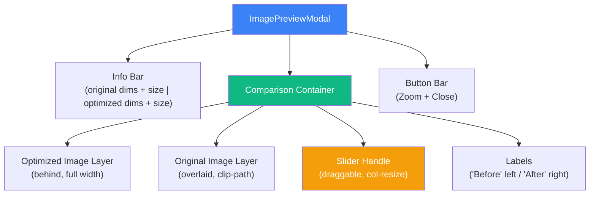
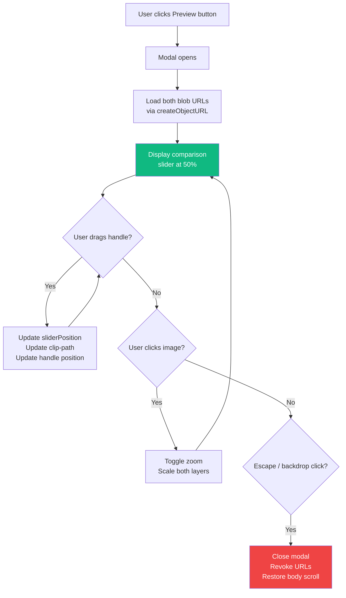
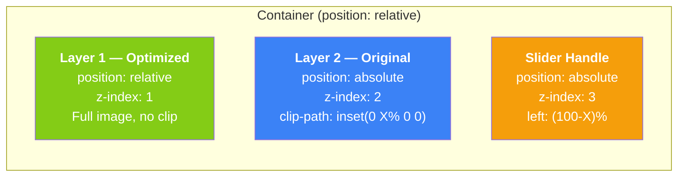

# Feature 002 — Before/After Slider in Image Preview Modal

> **Status**: 📋 Ready for implementation  
> **Branch**: `feat/002-before-after-slider`  
> **Type**: UX Enhancement  
> **Scope**: `ImagePreviewModal.vue` (major refactor)

---

## Summary

Replace the current side-by-side image comparison in the preview modal with an **interactive before/after slider**. The user drags a vertical divider over the image to reveal the original (left) and optimized (right) versions in a single, immersive view.

This creates a much more impactful visual comparison — especially compelling for a 10-minute live demo.

---

## Current Behavior

The `ImagePreviewModal.vue` currently displays two images **side-by-side**:

```
┌─────────────────────┬─────────────────────┐
│     Original         │     Optimized       │
│   (left panel)       │   (right panel)     │
│                      │                     │
│   + zoom support     │   + zoom support    │
└─────────────────────┴─────────────────────┘
```

Each panel has:
- A header with label, dimensions, and file size
- An image container with zoom in/out support (click-to-zoom + scroll)
- A "Zoom in" / "Zoom out" button

---

## Target Behavior

A single, full-width image with a **draggable vertical slider handle**:

```
┌───────────────────────────────────────────┐
│  Original        │        Optimized       │
│  (clipped)      ║│        (clipped)       │
│                 ║│                         │
│    ◀──────────  ║│  ──────────▶           │
│                 ║│                         │
└───────────────────────────────────────────┘
  ◄── Original ──►║│◄── Optimized ──────────►
                 ▲
            Slider handle (draggable)
```

### User Interactions

| Action | Behavior |
|---|---|
| **Drag the handle** | Moves the split left/right, revealing more of one side |
| **Click on image** | Zooms into the full image (both layers) at click position |
| **Zoom button** | Zooms into both layers simultaneously |
| **Touch drag** | Same as mouse drag — mobile-friendly |
| **Escape key** | Closes the modal (unchanged) |
| **Click backdrop** | Closes the modal (unchanged) |

---

## Technical Design

### Component Architecture

The entire feature is contained within `ImagePreviewModal.vue`. No new components or composables are needed.

### CSS Overlay Approach

The before/after effect uses **two overlapping images** with `clip-path`:

```
┌──────────────────────────────┐
│  ┌─────────┐                 │  ← Original image (full width)
│  │ CLIPPED │                 │     clip-path: inset(0 40% 0 0)
│  │  AREA   │                 │     clips the right 40%
│  └─────────┘                 │
│  ┌─────────────────────┐     │  ← Optimized image (full width, layered behind)
│  │     VISIBLE AREA    │     │     No clip — fills full container
│  │                     │     │
│  └─────────────────────┘     │
│              │                │  ← Slider handle (absolute positioned)
└──────────────────────────────┘
```

**Implementation:**

```scss
.comparison-container {
  position: relative;
  overflow: hidden;

  .image-layer-optimized {
    // Full image, sits behind
    width: 100%;
    img { width: 100%; height: 100%; object-fit: contain; }
  }

  .image-layer-original {
    // Overlaid, clipped from the right
    position: absolute;
    top: 0; left: 0;
    width: 100%; height: 100%;
    clip-path: inset(0 40% 0 0); // dynamic — controlled by slider position
    
    img { width: 100%; height: 100%; object-fit: contain; }
  }

  .slider-handle {
    position: absolute;
    top: 0;
    left: 60%; // = 100% - clip right%
    width: 4px;
    height: 100%;
    cursor: col-resize;
    // styled as a thin line + circular grab handle
  }
}
```

### State

```typescript
// Slider position (0 to 1, default 0.5 = centered)
const sliderPosition = ref(0.5)

// Whether user is currently dragging
const isDragging = ref(false)

// Computed clip-path for the original image overlay
const originalClipPath = computed(() =>
  `inset(0 ${(1 - sliderPosition.value) * 100}% 0 0)`
)

// Computed left offset for the slider handle
const sliderLeft = computed(() =>
  `${sliderPosition.value * 100}%`
)
```

### Drag Handling

```typescript
function onPointerDown(event: PointerEvent) {
  isDragging.value = true
  event.preventDefault()
  updateSliderPosition(event.clientX)
}

function onPointerMove(event: PointerEvent) {
  if (!isDragging.value) return
  updateSliderPosition(event.clientX)
}

function onPointerUp() {
  isDragging.value = false
}

function updateSliderPosition(clientX: number) {
  const container = containerRef.value!
  const rect = container.getBoundingClientRect()
  const x = clientX - rect.left
  sliderPosition.value = Math.max(0.02, Math.min(0.98, x / rect.width))
}

// Listen on document for pointerup/pointermove (drag can leave the container)
onMounted(() => {
  document.addEventListener('pointermove', onPointerMove)
  document.addEventListener('pointerup', onPointerUp)
})

onBeforeUnmount(() => {
  document.removeEventListener('pointermove', onPointerMove)
  document.removeEventListener('pointerup', onPointerUp)
})
```

### Zoom Support

The existing zoom feature (click-to-zoom, scroll) must be preserved and adapted:

- **Zoom applies to both layers simultaneously** — both images scale together
- **The slider handle scales with the zoom** — stays at the correct position
- **In zoomed mode**, the container becomes scrollable and the slider moves with the content
- The slider remains usable even when zoomed (the user can still drag it)

**Approach:** When zoomed, switch to `transform: scale(2)` on both image layers inside the container, and make the container `overflow: auto`. The clip-path percentage stays relative to the container, so it remains correct.

### Labels & Info Bar

The panel headers (label, dimensions, file size) are replaced by an **info bar** above the image:

```
┌───────────────────────────────────────────┐
│ Original: 4032 × 3024 — 4.2 MB  │  Optimized: 4032 × 3024 — 1.1 MB  │
├───────────────────────────────────────────┤
│                                           │
│          [Before/After Slider]            │
│                                           │
├───────────────────────────────────────────┤
│           [Zoom In]  [Close]              │
└───────────────────────────────────────────┘
```

---

## Files to Modify

### 1. `app/components/ImagePreviewModal.vue` — **Major refactor**

| What | Detail |
|---|---|
| **Template** | Replace the two `.preview-panel` divs with a single `.comparison-container` holding two layered images + slider handle + info bar |
| **Script** | Add `sliderPosition`, `isDragging`, pointer event handlers. Remove the dual-panel state (`panelState` object). Keep zoom logic but adapt for single container |
| **Style** | New layout CSS: `position: relative/absolute`, `clip-path`, slider handle styling, grab cursor. Remove `.preview-panel` styles. Add slider handle animation (subtle glow/pulse on hover) |

### 2. `i18n/locales/fr-FR.json` — **2 new keys**

```json
{
  "components": {
    "image_preview_modal": {
      "slider_hint": "Glisser pour comparer",
      "original_short_label": "Avant",
      "optimized_short_label": "Après"
    }
  }
}
```

### 3. `i18n/locales/en-US.json` — **2 new keys**

```json
{
  "components": {
    "image_preview_modal": {
      "slider_hint": "Drag to compare",
      "original_short_label": "Before",
      "optimized_short_label": "After"
    }
  }
}
```

> **Note:** The existing keys (`original_label`, `optimized_label`, `close_label`, `zoom_in_label`, `zoom_out_label`) are kept — they're still used in the info bar and buttons.

### 4. `app/assets/svg/` — **Optional: new icon**

Add `slider-handle.svg` (a vertical double-arrow or grip icon) if the default CSS handle isn't sufficient. A simple CSS circle/line handle may be enough:

```
     ┌───┐
     │ ◀ │
     │ ▶ │
     └───┘
```

---

## Design Specifications

### Slider Handle

| Property | Value |
|---|---|
| Width | 4px line + 40px circle handle centered on the line |
| Line color | `$white-color` with `box-shadow: 0 0 4px rgba(0,0,0,0.5)` |
| Circle | 40×40px, `$white-color` background, `border-radius: 50%`, subtle shadow |
| Circle icon | `◀ ▶` arrows (or just a grip pattern via CSS) |
| Cursor | `col-resize` on hover, `grabbing` while dragging |
| Hover effect | Subtle scale(1.1) on the circle |

### Labels on the Image

Two floating labels positioned over the image:

```
 ┌────────────────────────────────────┐
 │ "Avant"          │         "Après" │
 │                   ║                │
 │                   ║                │
 └────────────────────────────────────┘
```

- `position: absolute`, `top: 12px`, semi-transparent background pill
- "Before" label on the left side, "After" label on the right side
- Font size: 13px, white text, `background: rgba(0,0,0,0.5)`, `border-radius: 4px`, `padding: 2px 8px`

### Responsive

| Breakpoint | Behavior |
|---|---|
| Desktop (`> $md`) | Full width slider, side-by-side labels |
| Mobile (`≤ $md`) | Same slider (works great on touch), labels stack or shrink |

### Transitions

| Element | Transition |
|---|---|
| Slider handle hover | `transform 0.15s ease` |
| Modal open/close | Keep existing (instant) |
| Image load | Fade-in with `opacity 0 → 1` over 0.2s |

---

## Accessibility

| Requirement | Implementation |
|---|---|
| Keyboard control | Arrow keys Left/Right to move the slider by 2% per keypress |
| Screen reader | `role="slider"`, `aria-label="Compare original and optimized"`, `aria-valuenow`, `aria-valuemin="0"`, `aria-valuemax="100"` |
| Focus visible | Focus ring on the slider handle when focused via keyboard |
| Labels | Text labels "Before" / "After" always visible (not just color-coded) |

---

## Test Plan

### Unit Tests (`app/tests/components/ImagePreviewModal.test.ts`)

| Test | Description |
|---|---|
| Renders both images | Both original and optimized `` elements are present |
| Slider handle exists | A `.slider-handle` element is rendered |
| Default position | `sliderPosition` defaults to 0.5 (centered) |
| Drag moves slider | Simulate pointer events → `sliderPosition` updates |
| Drag clamped | Slider cannot go below 0.02 or above 0.98 |
| Escape closes modal | Keydown Escape emits `close` |
| Backdrop click closes | Click on backdrop emits `close` |
| Zoom button works | Click zoom button → images scale up |
| Labels display sizes | Original and optimized sizes are formatted and visible |
| Touch support | Touch events are handled (pointer events cover this) |

### Integration Considerations

- Test that `URL.createObjectURL` is called for both blobs and revoked on unmount
- Test keyboard slider control (arrow keys)
- Verify that the modal still blocks body scroll (`document.body.style.overflow`)

---

## Diagrams

### Component Structure (Mermaid)



### User Interaction Flow



### CSS Layer Rendering



---

## Implementation Order

| Step | Task | Est. Time |
|---|---|---|
| 1 | Add i18n keys to both locale files | 2 min |
| 2 | Refactor template: single comparison container + slider handle | 20 min |
| 3 | Add slider logic (pointer events, clip-path, position tracking) | 15 min |
| 4 | Style the slider handle (CSS circle + line + hover effects) | 10 min |
| 5 | Add floating "Before" / "After" labels over the image | 5 min |
| 6 | Adapt zoom to work with both layers | 15 min |
| 7 | Add keyboard control (arrow keys) | 5 min |
| 8 | Add accessibility attributes (role, aria-*) | 5 min |
| 9 | Update unit tests | 20 min |
| 10 | Visual QA (desktop + mobile + touch) | 10 min |
| **Total** | | **~1h45** |

---

## Open Questions

| # | Question | Suggestion |
|---|---|---|
| 1 | Should the slider handle have an SVG icon or CSS-only? | CSS-only (circle + grip lines) — simpler, no asset needed |
| 2 | Should zoom still work in slider mode? | Yes — both layers zoom together. Keep the zoom button. |
| 3 | Mobile: should labels be hidden on very small screens? | No — keep them but reduce font size to 11px |
| 4 | Animation on first open: should the slider animate from 0% to 50%? | Yes — subtle entrance animation (0.3s ease) for demo impact |
| 5 | Should there be a toggle to switch back to side-by-side? | Not for v1 — slider only. Can add later if users ask. |
