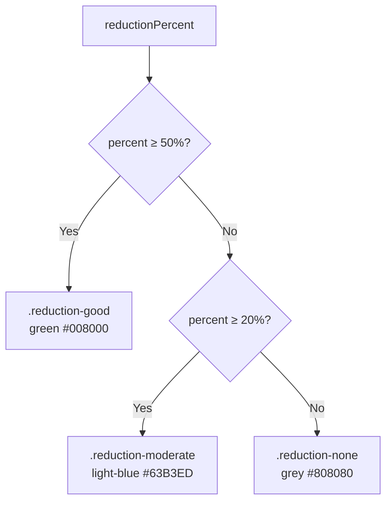
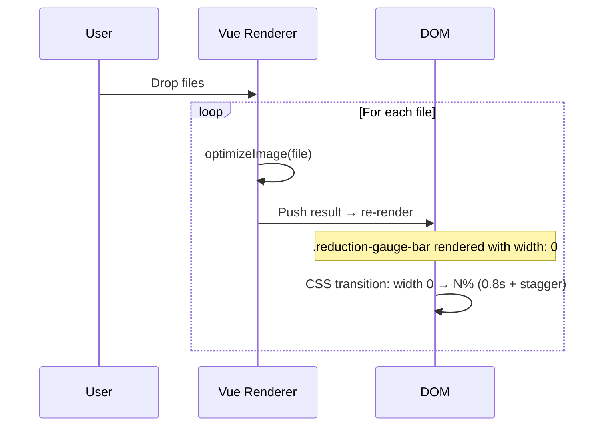

# Feature 003 — Reduction Gauge (Visual Size Reduction Bar)

## Summary

Add an animated gauge bar to each result item in `ImageUploader.vue` that visually represents the compression ratio. The bar fills proportionally to the reduction percentage, with color intensity reinforcing the result: greener = better compression.

This provides instant visual feedback without requiring the user to read the text — especially impactful in a demo when processing a batch of images.

---

## Current Behaviour

Each result item in `.results-list` displays:

```
┌─────────────────────────────────────────────────────────┐
│ image-name.webp                                         │
│ 2.40 MB → 0.85 MB (65% en moins)                       │
│                      [Aperçu] [Télécharger] [Supprimer] │
└─────────────────────────────────────────────────────────┘
```

The reduction percentage is text-only. The class `.reduction-good`, `.reduction-moderate`, or `.reduction-none` changes the text color, but there is no visual gauge element.

---

## Target Behaviour

After processing, each successful result item displays an animated gauge bar between the size text and the action buttons:

```
┌─────────────────────────────────────────────────────────┐
│ image-name.webp                                         │
│ 2.40 MB → 0.85 MB (65% en moins)                       │
│ ████████████████████████████░░░░░░░░  65%               │
│                      [Aperçu] [Télécharger] [Supprimer] │
└─────────────────────────────────────────────────────────┘
```

- **Width**: Proportional to `reductionPercent(item)`. A 65% reduction fills 65% of the bar.
- **Color**: Gradient from warm (low reduction) to vivid green (high reduction), using existing project SCSS variables.
- **Animation**: Bar fills from 0 to target width with a smooth CSS transition + a subtle shimmer on completion.
- **Accessibility**: `role="progressbar"` with `aria-valuenow`, `aria-valuemin="0"`, `aria-valuemax="100"`.
- **Failed items**: No gauge displayed (item has `success: false`).

---

## Technical Design

### 1. Computed Gauge Data

No new composable needed. A helper function inside `ImageUploader.vue` computes the gauge style on the fly, similar to the existing `reductionClass()` pattern:

```typescript
function gaugeStyle(item: ResultItem): Record<string, string> {
  const percent = reductionPercent(item)
  return {
    width: `${Math.max(0, percent)}%`,
    backgroundColor: gaugeColor(percent),
  }
}

function gaugeColor(percent: number): string {
  if (percent >= 50) return $green-color    // #008000
  if (percent >= 20) return $light-blue-color // #63B3ED
  return $grey-color                          // #808080
}
```

> **Note**: Since we're in `<script setup>`, SCSS variables aren't available in JS. The bar color is applied via a CSS class (same pattern as `reductionClass`). See Section 4 below.

### 2. Template Change

Inside `.item-details`, after the `.item-size` div, add the gauge element — **only for successful items**:

```vue
<div v-if="item.success" class="reduction-gauge-container">
  <div
    class="reduction-gauge-bar"
    :class="reductionClass(item)"
    :style="{ width: reductionPercent(item) + '%' }"
    role="progressbar"
    :aria-valuenow="reductionPercent(item)"
    aria-valuemin="0"
    aria-valuemax="100"
    :aria-label="gaugeAriaLabel(item)"
  />
</div>
```

### 3. Reduction Percent Exposed in Template

The function `reductionPercent(item)` already exists in the script. It's currently only used inside `formatImageReductionWording()`. No change needed — it can be called directly from the template (Vue 3 auto-binds script functions).

### 4. SCSS Styling

```scss
.reduction-gauge-container {
  height: 6px;
  background: $light-grey-color;    // #CBD5E0 — track
  border-radius: 3px;
  margin-top: 6px;
  overflow: hidden;
  position: relative;
}

.reduction-gauge-bar {
  height: 100%;
  border-radius: 3px;
  width: 0;                          // initial state, animated to target
  transition: width 0.8s cubic-bezier(0.22, 1, 0.36, 1);

  &.reduction-good {
    background: $green-color;        // #008000 — 50%+ reduction
  }

  &.reduction-moderate {
    background: $light-blue-color;   // #63B3ED — 20–49% reduction
  }

  &.reduction-none {
    background: $grey-color;         // #808080 — <20% reduction
  }
}
```

**Why CSS transitions and not JS animation?** The bar is rendered with `width: 0` on mount, then Vue reactively sets the target width. CSS `transition: width 0.8s` handles the smooth fill automatically — zero JS animation code needed.

### 5. Staggered Animation (Optional Enhancement)

For batch results, stagger the gauge fill to create a cascade effect. This can be achieved with a CSS custom property for delay:

```vue
<div
  class="reduction-gauge-bar"
  :class="reductionClass(item)"
  :style="{
    width: reductionPercent(item) + '%',
    '--gauge-delay': (idx * 0.15) + 's',
  }"
/>
```

```scss
.reduction-gauge-bar {
  transition: width 0.8s cubic-bezier(0.22, 1, 0.36, 1) var(--gauge-delay, 0s);
}
```

This creates a satisfying sequential fill when multiple results appear at once — **highly recommended for the demo**.

---

## Files to Modify

| File | Change |
|---|---|
| `app/components/ImageUploader.vue` | Template: add gauge element in `.item-details`. Script: add `gaugeAriaLabel()`. Style: add gauge SCSS classes. |
| `i18n/locales/fr-FR.json` | Add 1 key: `components.image_uploader.reduction_gauge_label` |
| `i18n/locales/en-US.json` | Add 1 key: `components.image_uploader.reduction_gauge_label` |

No new components, no new types, no new composables.

---

## i18n Keys

### `fr-FR.json`

```json
{
  "components": {
    "image_uploader": {
      "reduction_gauge_label": "Réduction de {percent}%"
    }
  }
}
```

### `en-US.json`

```json
{
  "components": {
    "image_uploader": {
      "reduction_gauge_label": "{percent}% reduction"
    }
  }
}
```

---

## Design Specs

### Color Mapping (reuses existing SCSS variables)

| Reduction | Class | Bar Color | Variable |
|---|---|---|---|
| ≥ 50% | `.reduction-good` | Green `#008000` | `$green-color` |
| 20–49% | `.reduction-moderate` | Light blue `#63B3ED` | `$light-blue-color` |
| < 20% | `.reduction-none` | Grey `#808080` | `$grey-color` |

### Track (background)

- Color: `$light-grey-color` (`#CBD5E0`)
- Height: `6px`
- Border-radius: `3px`

### Bar (fill)

- Height: `6px` (same as track)
- Border-radius: `3px`
- Transition: `width 0.8s cubic-bezier(0.22, 1, 0.36, 1)` — ease-out-quint feel
- Stagger delay: `idx × 0.15s` (via CSS custom property)

### Layout

- Full width of `.item-details`
- Positioned below `.item-size` text
- `margin-top: 6px` spacing

---

## Accessibility

| Aspect | Implementation |
|---|---|
| **Role** | `role="progressbar"` on the bar element |
| **Value** | `aria-valuenow` bound to `reductionPercent(item)` |
| **Range** | `aria-valuemin="0"`, `aria-valuemax="100"` (static) |
| **Label** | `aria-label` with localized string including the percentage |
| **Color** | Not the only indicator — text with percentage already exists in `.item-size` |
| **Keyboard** | No keyboard interaction needed (read-only indicator) |

---

## Tests

### Unit Tests (`app/tests/components/imageUploader.test.ts`)

Add the following test cases to the existing test file:

| # | Test Case | Assertion |
|---|---|---|
| 1 | **Renders gauge for successful item** | After processing a valid image, `.reduction-gauge-bar` exists in the result item |
| 2 | **No gauge for failed item** | For an unsupported format (`.bmp`), no `.reduction-gauge-bar` is rendered |
| 3 | **Gauge width matches reduction** | For a 65% reduction, the bar's inline style has `width: 65%` |
| 4 | **Gauge class — good reduction (≥50%)** | Item with ≥50% reduction has `.reduction-good` on the gauge bar |
| 5 | **Gauge class — moderate reduction (20–49%)** | Item with 20–49% reduction has `.reduction-moderate` on the gauge bar |
| 6 | **Gauge class — low reduction (<20%)** | Item with <20% reduction has `.reduction-none` on the gauge bar |
| 7 | **Accessibility attributes** | Gauge bar has `role="progressbar"`, `aria-valuenow`, `aria-valuemin="0"`, `aria-valuemax="100"` |
| 8 | **Staggered delay** | With 3 results, each bar has an incremented `--gauge-delay` custom property (`0s`, `0.15s`, `0.3s`) |

### Testing Pattern

Follow the existing patterns in `imageUploader.test.ts`:
- Use `mountSuspended` with `mockNuxtImport('optimizeImage', ...)`
- Use `installOffscreenCanvasMock` for canvas-dependent optimization
- Trigger file drop, flush async with `waitForPromises`
- Query the rendered gauge bar within the specific result item

---

## Diagrams

### Component Structure (after change)

```mermaid
graph TD
  A[ImageUploader.vue] --> B[".results-list"]
  B --> C[".results-list-item" v-for]
  C --> D[".item-details"]
  D --> E[".item-name"]
  D --> F[".item-size + reductionClass"]
  D --> G[".reduction-gauge-container" v-if="item.success"]
  G --> H[".reduction-gauge-bar"]
  C --> I[".item-actions"]
```

### Gauge Color Logic



### Render Timeline



---

## Implementation Order

| Step | Description | Est. Time |
|---|---|---|
| 1 | Add i18n keys in `fr-FR.json` and `en-US.json` | 2 min |
| 2 | Add `gaugeAriaLabel()` helper in `<script setup>` | 3 min |
| 3 | Add gauge HTML in template (inside `.item-details`) | 5 min |
| 4 | Add SCSS classes (`.reduction-gauge-container`, `.reduction-gauge-bar`, color variants) | 5 min |
| 5 | Add stagger delay via CSS custom property `--gauge-delay` bound to `idx` | 3 min |
| 6 | Verify manually with browser (drop a batch, check animation cascade) | 5 min |
| 7 | Add unit tests (8 test cases) | 20 min |
| 8 | Run full test suite (`npx vitest run`) and fix any regressions | 5 min |
| 9 | Lint check (`yarn lint`) | 2 min |
| **Total** | | **~50 min** |

---

## Edge Cases

| Case | Behaviour |
|---|---|
| **0% reduction** (file got bigger or same size) | Gauge renders with `width: 0%` — effectively invisible. Text still shows the data. |
| **Negative reduction** (optimized > original) | `Math.max(0, percent)` — gauge stays at 0%. |
| **Failed optimization** (`success: false`) | No gauge rendered (`v-if="item.success"`). |
| **Single image** | No stagger delay (`idx = 0 → --gauge-delay: 0s`), immediate fill. |
| **Many images (50+)** | Stagger capped by natural batch processing speed — results appear sequentially anyway. |

---

## Out of Scope

- Tooltip on hover showing exact reduction percentage (already in text)
- Click interaction on the gauge
- Global summary gauge (could be a future enhancement for BatchSummary feature)
- Configurable gauge colors
