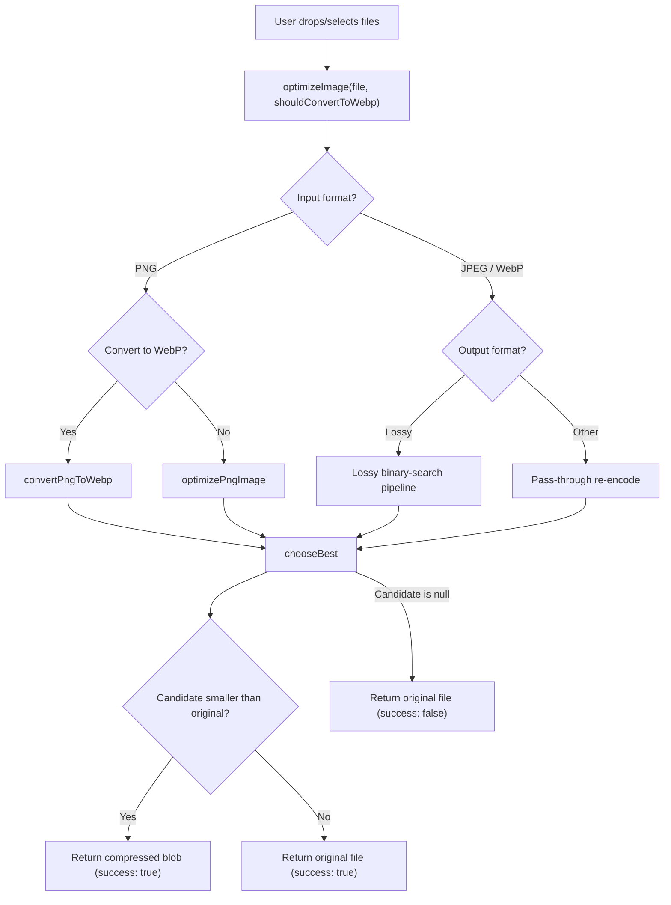
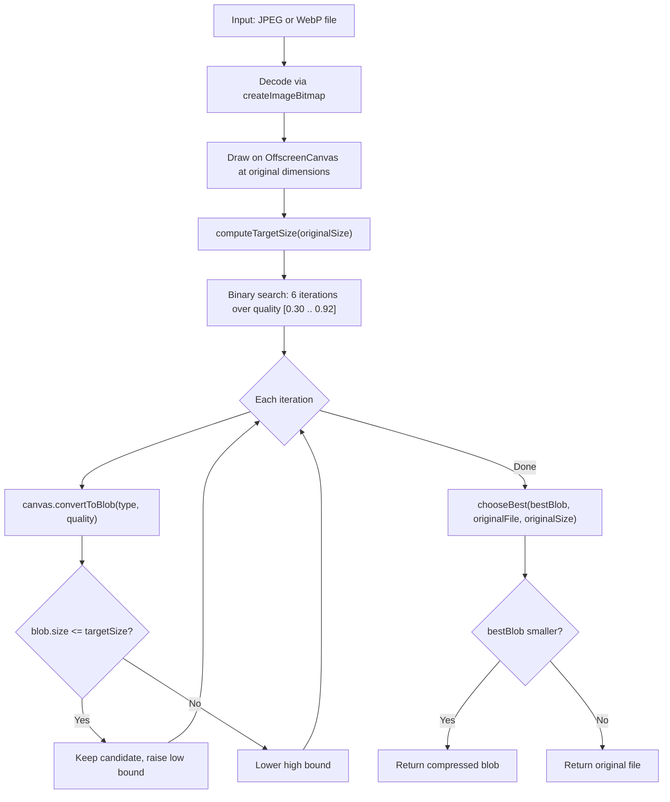
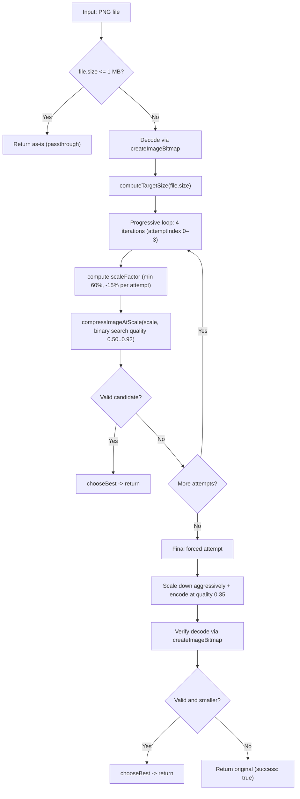
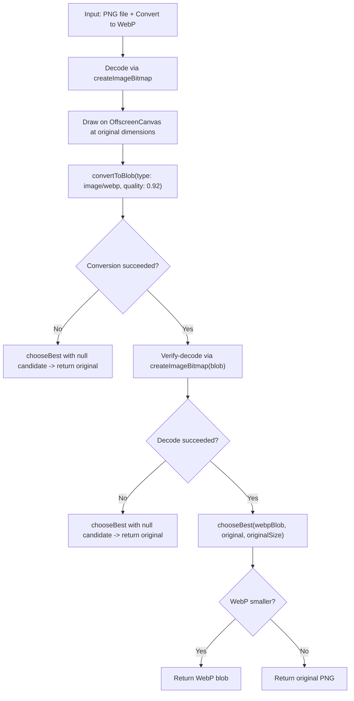
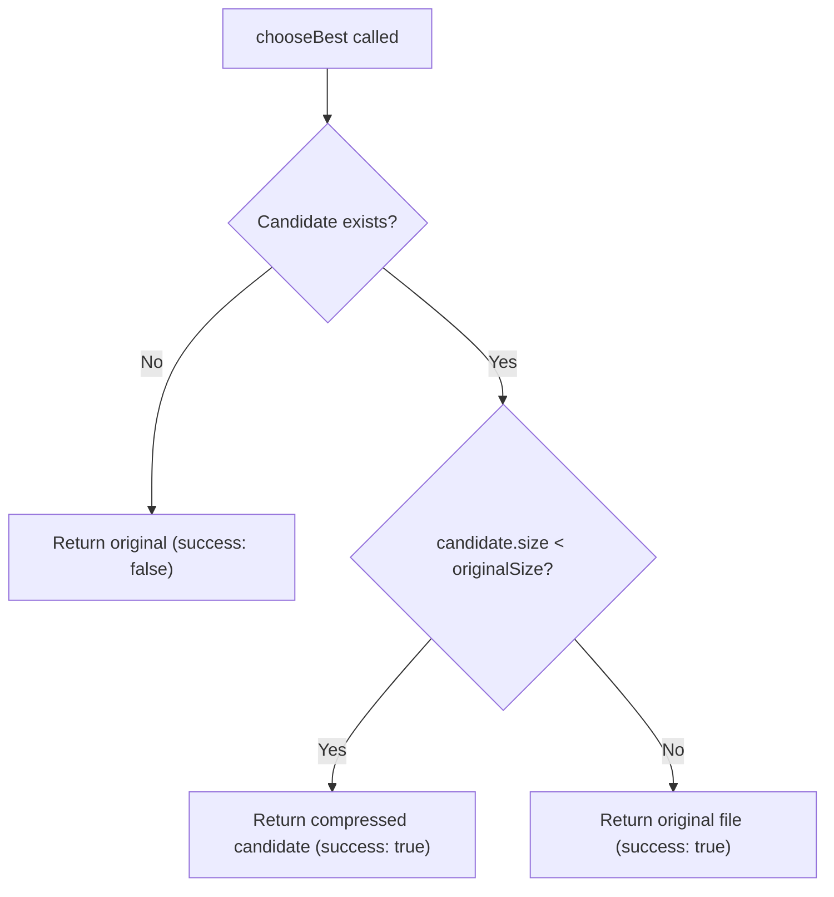
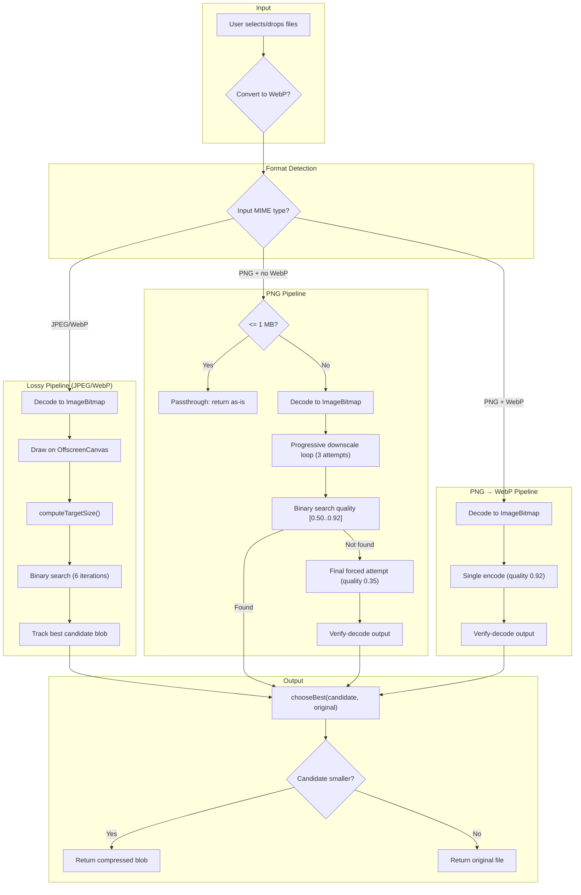
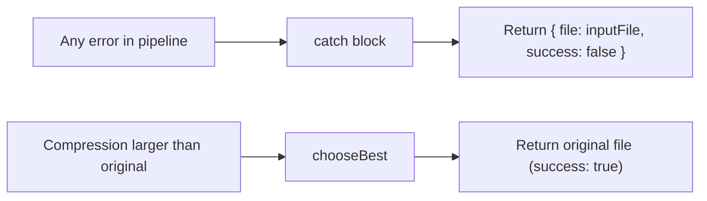

# Image Optimizer Engine

## Overview

PictoLite's image optimizer is a **client-side, browser-based compression engine** powered by `OffscreenCanvas` and `createImageBitmap`. All processing happens in the user's browser — no files are uploaded to any server.

The engine supports **JPEG**, **PNG**, and **WebP** input formats, with an optional conversion to WebP output. It uses different compression strategies depending on the input format, with dedicated pipelines for lossy formats (JPEG/WebP) and PNG.

**Source code:** `app/composables/useImageOptimizer.ts`

---

## Architecture at a Glance



---

## Entry Point

```typescript
optimizeImage(inputFile: File, shouldConvertToWebp: boolean): Promise<FileResult>
```

Returns a `FileResult`:
```typescript
{ file: Blob, success: boolean }
```

> **Important:** `success: true` does **not** guarantee a smaller file. The `chooseBest()` function always returns the original file if compression produces a larger result.

---

## Pipeline 1: Lossy Formats (JPEG, WebP)

This pipeline handles JPEG and WebP images. It uses a binary search algorithm to find the optimal quality level that produces the smallest file under a computed target size.



### How it works step by step

1. **Decode** the input file into an `ImageBitmap` via `createImageBitmap()` — this converts the compressed file into raw pixel data in memory.
2. **Draw** the bitmap onto an `OffscreenCanvas` at the original image dimensions (no downscaling in this pipeline).
3. **Compute the target size** using a tiered ratio table (see below).
4. **Binary search** over the quality range `[0.30, 0.92]` for 6 iterations:
   - Each iteration encodes the canvas at the midpoint quality.
   - If the resulting blob exceeds the target size, the upper bound drops.
   - If it fits, the lower bound rises and the candidate is kept.
   - Early exit if the best candidate already fits and the range is narrow enough (`< 0.01`).
5. **Choose the best** — `chooseBest()` compares the best candidate against the original. If compression didn't help, the original file is returned unchanged.

### Target size computation

The `computeTargetSize()` function determines how aggressively to compress based on the original file size:

| Original Size | Target | Example |
|---|---|---|
| <= 200 KB | Returned as-is (no compression) | A 150 KB JPEG is untouched |
| <= 1 MB | 90% of original | 800 KB -> target 720 KB |
| <= 5 MB | 60% of original | 3 MB -> target 1.8 MB |
| <= 10 MB | 25% (floor: 1 MB) | 7 MB -> target 1.75 MB |
| <= 30 MB | 15% (floor: 1.5 MB) | 20 MB -> target 3 MB |
| > 30 MB | 12% (floor: 2 MB) | 50 MB -> target 6 MB |

### Is it destructive? (Visible to the naked eye)

**Yes, but subtly.** JPEG and WebP are lossy formats by nature. The binary search finds the *highest quality* that fits under the target size, which means:

- **Small files** (<= 200 KB): Not compressed at all. No quality loss.
- **Small-to-medium files** (200 KB - 1 MB): Very light compression (target 90%). Degradation is barely perceptible — slight softening of fine details.
- **Medium files** (1-5 MB): Moderate compression (target 60%). You may notice mild artifacting in high-frequency areas (textures, hair, text overlaid on photos).
- **Large files** (5-30 MB): Aggressive compression. Visible quality reduction, especially in detailed regions. Block artifacts may appear in JPEG output.
- **Very large files** (> 30 MB): Most aggressive. Quality loss will be noticeable on close inspection.

In practice, for most photographs shared online, the compression is **acceptable and often imperceptible** at normal viewing distances. For images with text overlays or sharp geometric edges, artifacts may be more visible.

---

## Pipeline 2: PNG Optimization

PNG files use a **completely separate pipeline** with conservative parameters designed to preserve text readability, sharp edges, and transparency.



### How it works step by step

1. **Passthrough check**: PNG files <= 1 MB are returned **completely untouched**. Small PNGs are already well-compressed, and Canvas-based recompression rarely improves them while often degrading text and sharp edges.
2. **Decode** the input via `createImageBitmap()`.
3. **Compute target size** using the same `computeTargetSize()` tiered table.
4. **Progressive downscale loop** (4 iterations, indices 0–3):
   - Each iteration computes a scale factor starting from a minimum of 60%, reduced by 15% per step (`DOWNSCALE_STEP_FACTOR = 0.85`). The loop condition is `attemptIndex <= localMaxDownscaleAttempts` where `localMaxDownscaleAttempts = 3`, yielding 4 total iterations.
   - At each scale, a binary search finds the best quality in the range `[0.50, 0.92]` — notably higher than the lossy pipeline's `[0.30, 0.92]`.
   - If a valid candidate (under target size) is found, it goes through `chooseBest()` and is returned.
5. **Final forced attempt**: If all progressive iterations fail, a last-ditch effort:
   - Aggressive downscaling (cumulative with all previous reductions).
   - Quality set to 0.35 (lower than the progressive range).
   - **Verify-decode**: The resulting blob is decoded via `createImageBitmap()` to ensure it's a valid image. Corrupt outputs are rejected.
6. If even the forced attempt fails, the **original file is returned** with `success: true`.

### PNG-specific parameters

| Parameter | Value | Lossy equivalent | Rationale |
|---|---|---|---|
| Minimum initial scale | 60% | 100% | PNGs often contain text; don't shrink too aggressively |
| Max downscale attempts | 3 (4 iterations: 0–3) | N/A (no downscaling) | Limit resolution loss |
| Quality lower bound | 0.50 | 0.30 | Preserve text and edges |
| Final forced quality | 0.35 | N/A | Last resort, still not as aggressive |
| Verify-decode | Yes | No | Ensure re-encoded PNG is valid |

### Is it destructive? (Visible to the naked eye)

**For PNGs <= 1 MB: No.** They are returned byte-for-byte identical to the input.

**For PNGs > 1 MB: Yes, potentially.** The PNG pipeline re-encodes the image through Canvas, which means:

- **Resolution loss**: The image is scaled down (minimum 60%, decreasing by 15% per attempt). For a 4000px wide PNG, the first attempt targets ~2400px. This is visually noticeable if the image is viewed at full resolution.
- **Transparency is preserved** because the output is still PNG format.
- **Text quality**: The conservative quality range (0.50-0.92) is designed to minimize text degradation, but some softening is inevitable when re-encoding through Canvas.
- **Color accuracy**: Canvas re-encoding may introduce slight color shifts, particularly in gradients.

> **Note:** Canvas-based PNG re-encoding produces a rasterized version. Any optimization potential comes primarily from resolution reduction, not from better PNG compression algorithms.

---

## Pipeline 3: PNG to WebP Conversion

When the user enables the "Convert to WebP" option, PNG files take a dedicated conversion path.



### How it works

1. **Decode** the PNG via `createImageBitmap()`.
2. **Draw** at original dimensions (no downscaling).
3. **Single encode** at `quality: 0.92` (the upper bound — highest quality possible).
4. **Verify-decode** the resulting WebP blob to ensure it's a valid image.
5. **Choose best** — if the WebP is smaller, return it; otherwise return the original PNG.

### Is it destructive?

**Mildly.** The conversion uses quality 0.92, which is very high. For most photographic PNGs, the WebP output will be visually identical. However:

- **Transparency is preserved** (WebP supports alpha channels).
- **Fine details** (single-pixel lines, small text) may experience very slight softening due to WebP's lossy encoding.
- The main trade-off is **format change**, not quality loss.

---

## The chooseBest Safety Net

Every pipeline ends with a call to `chooseBest(candidate, originalFile, originalSize)`:



This function is the **final safety net**. It guarantees:

1. **Output is never larger than input** — if compression doesn't help, you get your original file back.
2. **`success: false`** means something went wrong during processing (conversion error, null candidate).
3. **`success: true`** means either compression worked and the result is smaller, or compression was attempted but the original was returned because it was already optimal.

---

## Metadata Handling

### What happens to EXIF, GPS, dates, and camera info?

**All metadata is stripped.** This is an inherent consequence of the processing pipeline:

1. The input file is decoded into raw pixels via `createImageBitmap()` — this step **discards all EXIF metadata** (camera model, GPS coordinates, timestamps, orientation, etc.).
2. The pixels are drawn onto an `OffscreenCanvas`.
3. The canvas is re-encoded via `convertToBlob()` — this produces a **clean blob with no embedded metadata**.

### What is NOT preserved

| Metadata field | Preserved? | Notes |
|---|---|---|
| Camera make/model | No | Lost during bitmap decode |
| GPS coordinates | No | Lost during bitmap decode |
| Date/Time original | No | Lost during bitmap decode |
| EXIF orientation | No | Applied during decode, then stripped |
| IPTC/IIM data | No | Lost during bitmap decode |
| XMP data | No | Lost during bitmap decode |
| ICC color profile | Partial | Browser applies it during decode, but output uses sRGB |
| Image dimensions | Yes | Preserved (or reduced in PNG pipeline) |
| Transparency (alpha) | Yes | Preserved in PNG and WebP with alpha |
| Color depth | Reduced | Canvas uses 8-bit per channel |

### Why not preserve metadata?

The `OffscreenCanvas` API is designed for pixel manipulation, not file format fidelity. It has no API to read, preserve, or write EXIF chunks. Preserving metadata would require:

- A separate EXIF parsing library (e.g., `exifr`, `exif-js`)
- Extracting metadata before Canvas processing
- Re-embedding it into the output blob using a binary manipulation library

This is a deliberate trade-off: **simplicity and reliability over metadata preservation.**

---

## Compression Constants Reference

| Constant | Value | Purpose |
|---|---|---|
| `BINARY_SEARCH_ITERATIONS` | 6 | Number of quality search steps |
| `QUALITY_LOWER_BOUND` | 0.30 (30%) | Minimum quality for lossy pipeline |
| `QUALITY_UPPER_BOUND` | 0.92 (92%) | Maximum quality (browser cap) |
| `MAX_INITIAL_COMPRESSION_RATIO` | 1.0 (100%) | No upscaling |
| `DOWNSCALE_STEP_FACTOR` | 0.85 | 15% size reduction per PNG attempt |
| `MIN_ALLOWED_SCALE` | 0.05 (5%) | Absolute minimum scale for PNG forced attempt |
| `PNG_PASSTHROUGH_THRESHOLD` | 1 MB | PNGs below this are returned as-is |
| PNG local quality lower | 0.50 (50%) | PNG binary search minimum quality |
| PNG local quality upper | 0.92 (92%) | PNG binary search maximum quality |
| PNG final forced quality | 0.35 (35%) | Quality for PNG last-resort attempt |
| PNG min initial scale | 0.60 (60%) | Don't shrink PNGs below 60% initially |
| PNG max downscale attempts | 3 | Number of progressive attempts |

---

## Browser APIs Used

All processing relies on browser-native APIs. No WebAssembly, no server calls, no external libraries for compression.

### OffscreenCanvas

```typescript
const canvas = new OffscreenCanvas(width, height)
const ctx = canvas.getContext('2d')
ctx.drawImage(imageBitmap, 0, 0, width, height)
const blob = await canvas.convertToBlob({ type: 'image/webp', quality: 0.8 })
```

- Provides off-thread (or at least off-DOM) rendering.
- `convertToBlob()` is the core compression method — it encodes the canvas pixels into a Blob at the specified MIME type and quality.
- **Supported output types** vary by browser: `image/png` (lossless), `image/jpeg` (lossy), `image/webp` (lossy or lossless).

### createImageBitmap

```typescript
const imageBitmap = await createImageBitmap(inputFile)
```

- Decodes an image file (JPEG, PNG, WebP, etc.) into an `ImageBitmap` — raw pixel data optimized for rendering.
- Used both for **decoding input files** and for **verify-decoding output blobs** (ensuring the compressed result is a valid image).
- `imageBitmap.close()` is called after use to free GPU/memory resources.

### showSaveFilePicker (File System Access API)

```typescript
const handle = await window.showSaveFilePicker({ suggestedName: 'photo.webp', types: [...] })
const writable = await handle.createWritable()
await writable.write(blob)
await writable.close()
```

- Provides a native "Save As" dialog in supported browsers (Chrome, Edge).
- Falls back to `<a download>` in Firefox, Safari, and other browsers.
- User cancellation (`AbortError`) is handled gracefully — no fallback download is triggered.

---

## Complete Flow Diagram



---

## Summary: What the Engine Does to Your Image

| Aspect | Effect |
|---|---|
| **File size** | Reduced (or original returned if compression doesn't help) |
| **Resolution** | Preserved for JPEG/WebP; potentially reduced for large PNGs |
| **Quality** | Reduced proportionally to target size; quality 0.92 max |
| **Metadata** | **All stripped** (EXIF, GPS, dates, camera info, orientation) |
| **Transparency** | Preserved (PNG output and WebP with alpha) |
| **Color profile** | Converted to sRGB during Canvas processing |
| **Format** | Preserved by default; optional WebP conversion |
| **Reversibility** | **Not reversible** — compression is lossy and metadata is gone |

---

## Error Handling

The engine is designed to **never lose data**:

- If `createImageBitmap` fails (unsupported format, corrupt file), the catch block returns `{ file: inputFile, success: false }`.
- If `convertToBlob` fails, the candidate is null and `chooseBest` returns the original.
- If the verify-decode step fails (PNG forced attempt, PNG→WebP), the output is rejected and the original is returned.
- If any unexpected error occurs anywhere in the pipeline, the outer try/catch returns the original file with `success: false`.



---

## Limits and Edge Cases

| Case | Behavior |
|---|---|
| File <= 200 KB (JPEG/WebP) | `computeTargetSize` sets target = original size; binary search still runs but compression rarely helps |
| PNG <= 1 MB | Returned as-is (passthrough) |
| Unsupported format (e.g. GIF, BMP) | Reaches Canvas decode; may succeed or fail depending on browser |
| Corrupt file | `createImageBitmap` throws; original returned with `success: false` |
| Very large file (> 30 MB) | Aggressive compression (target 12%, floor 2 MB) |
| Animated images (GIF, animated WebP) | Only the first frame is processed (Canvas limitation) |
| SVG input | Rasterized at its intrinsic dimensions via `createImageBitmap` |
